  <strong>Arctos</strong>

<h3 align="center">Quantitative Investment & Risk Intelligence</h3>

Arctos is a quantitative investment research and risk analytics firm. Our suite of tools — MACS (Multi-Asset Class System) — provides institutional-grade portfolio construction, risk attribution, strategic and tactical asset allocation, and liquidity analytics. We combine deep financial domain knowledge with modern data engineering to deliver robust, auditable investment workflows.

<em>A <strong>jeannAI</strong> company</em>

---

## Organizational Structure

Arctos operates as an **AI-native organization** — a 33-role Arctos structure (34 nodes incl. holding context) where humans, hybrid human+AI roles, and autonomous AI agents work together under clear accountability frameworks.

> **[Open interactive org chart](https://arctoscap.github.io/.github/organigram.html)** — zoomable, expandable D3 visualization with agent details

```mermaid
%%{init: {"flowchart": {"nodeSpacing": 30, "rankSpacing": 60}} }%%
flowchart TD
    classDef human fill:#2E8B57,color:#fff,stroke:#0F172A
    classDef hybrid fill:#0D5C63,color:#fff,stroke:#0F172A
    classDef ai fill:#00B894,color:#fff,stroke:#0F172A
    classDef holding fill:#1E1B4B,color:#fff,stroke:#0F172A

    %% Holding context (jeannAI)
    CEO["CEO<br/><small>jeannAI</small>"]:::holding

    %% Arctos Leadership
    AMD["Arctos MD<br/><small>Human</small>"]:::human
    CEO --> AMD

    %% Investment / Front Office
    CIO["CIO<br/><small>Human</small>"]:::human
    AMD --> CIO
    PMA["PM Multi-Asset<br/><small>Hybrid</small>"]:::hybrid
    PMAC["PM Alts/Crypto<br/><small>Hybrid</small>"]:::hybrid
    PMFI["PM Fixed Income<br/><small>Hybrid</small>"]:::hybrid
    QAA["QA Alpha<br/><small>Hybrid</small>"]:::hybrid
    QAF["QA Factors<br/><small>Hybrid</small>"]:::hybrid
    RAF["RA Fundamental<br/><small>Hybrid</small>"]:::hybrid
    RAM["RA Macro<br/><small>Hybrid</small>"]:::hybrid
    TRD["Trader<br/><small>Hybrid</small>"]:::hybrid
    LIB["Librarian<br/><small>AI</small>"]:::ai
    CIO --> PMA
    CIO --> PMAC
    CIO --> PMFI
    CIO --> QAA
    CIO --> QAF
    CIO --> RAF
    CIO --> RAM
    CIO --> TRD
    CIO --> LIB

    %% Risk & Compliance
    HOR["Head of Risk<br/><small>Human</small>"]:::human
    AMD --> HOR
    RA["Risk Analyst<br/><small>Hybrid</small>"]:::hybrid
    CO["Compliance Ofc<br/><small>Hybrid</small>"]:::hybrid
    MV["Model Val.<br/><small>AI</small>"]:::ai
    HOR --> RA
    HOR --> CO
    HOR --> MV

    %% Technology
    TL["Tech Lead<br/><small>Hybrid</small>"]:::hybrid
    AMD --> TL
    HoD["Head of Data<br/><small>Hybrid</small>"]:::hybrid
    DE["Data Eng<br/><small>Hybrid</small>"]:::hybrid
    QD["Quant Dev<br/><small>Hybrid</small>"]:::hybrid
    TSD["Trading Sys Dev<br/><small>Hybrid</small>"]:::hybrid
    DOE["DevOps<br/><small>Hybrid</small>"]:::hybrid
    AFE["Frontend Eng<br/><small>Hybrid</small>"]:::hybrid
    TL --> HoD
    TL --> DE
    TL --> QD
    TL --> TSD
    TL --> DOE
    TL --> AFE

    %% Operations
    HOO["Head of Ops<br/><small>Hybrid</small>"]:::hybrid
    AMD --> HOO
    TOA["Trade Ops<br/><small>Hybrid</small>"]:::hybrid
    FA["Fund Acctg<br/><small>Hybrid</small>"]:::hybrid
    PA["Perf Analyst<br/><small>Hybrid</small>"]:::hybrid
    RS["Reporting<br/><small>Hybrid</small>"]:::hybrid
    HOO --> TOA
    HOO --> FA
    HOO --> PA
    HOO --> RS

    %% Distribution
    ASD["Sales Director<br/><small>Human</small>"]:::human
    AMD --> ASD
    IR["IR Manager<br/><small>Hybrid</small>"]:::hybrid
    PS["Product Spec.<br/><small>Hybrid</small>"]:::hybrid
    RFP["RfP Specialist<br/><small>Hybrid</small>"]:::hybrid
    BD["Biz Dev<br/><small>AI</small>"]:::ai
    ASD --> IR
    ASD --> PS
    ASD --> RFP
    ASD --> BD

    %% Cross-functional
    ESG["ESG Analyst<br/><small>Hybrid</small>"]:::hybrid
    AMD --> ESG
```

**Legend:** Human (4) · Hybrid (26) · AI (3) · Holding (1) · **34 nodes**

---

  <strong>Arctos</strong> — Precision. Discipline. Clarity.

